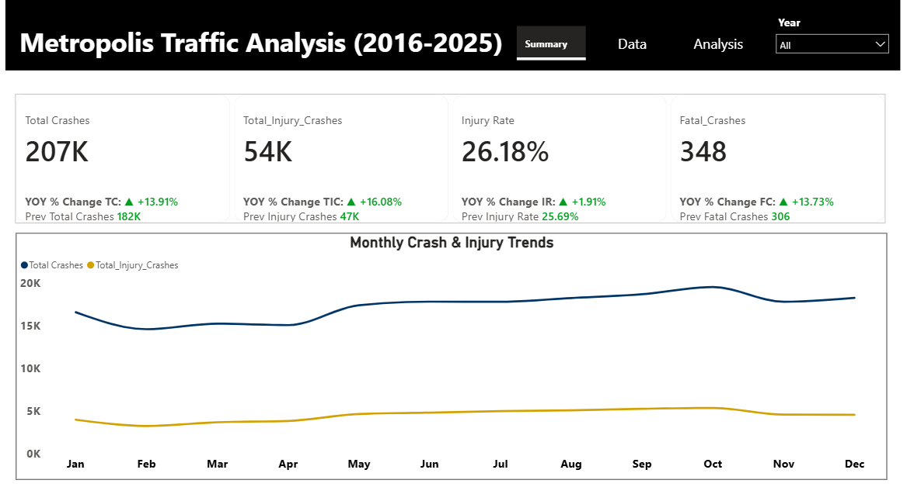
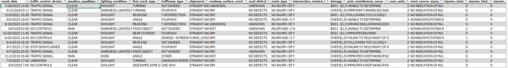

# Traffic Safety Analysis for Metropolis (2016–2025)
Analyzing 10 years of traffic crash data to uncover safety risks, reduce fatalities, and support data-driven city planning decisions.

## Project Overview
- The City Planning Department of Metropolis needed a clear, data-driven view of traffic crash patterns to guide safety initiatives and justify budget allocations. Historical crash data existed but lacked structure, interactivity, and actionable insights.
- This project transforms raw traffic crash records into an interactive Power BI report that highlights trends, injury severity, high-risk factors, and operational insights for leadership.

## Objectives
- Identify long-term trends in traffic crashes (2016–2025).
- Analyze causes and conditions leading to severe and fatal crashes.
- Highlight high-risk time periods and roadway types.
- Provide actionable insights for public safety and infrastructure planning.
- Demonstrate proficiency in Power BI, Power Query, and DAX.

 ## Dashboard Structure
Page 1&2 – Executive Summary

- KPI cards with Year-over-Year comparison.
- Trend analysis of total crashes vs. injury crashes.
- Distribution of crashes by injury severity.
- Leading causes of fatal and incapacitating crashes.
- Year-based slicer for report-wide filtering.
  
Page 2&3 – Deep Dive Analysis

- Hourly crash distribution.
- High-risk roadway types.
- Crash counts by weather condition.
- Year-based slicer for focused analysis.

## Dataset & Scope

Source: City of Metropolis (traffic_accidents.csv).

Records: 49,000+ crash reports.

Time Period: January 2016 – December 2025.

Key Fields:
Crash date, injury severity, contributory cause, weather condition, roadway type, crash hour, number of vehicles, and injury outcomes.

## Tools & Technologies

- Power BI.
- Power Query (ETL).
- DAX.
- Data Modeling.

## Data Preparation & Modeling

Key transformation steps included:

- Validated and corrected data types (e.g., crash_date formatted as Date).
- Handled missing values and standardized “UNKNOWN” categories.
- Created a Date Dimension Table to support time-based analysis.
- Implemented a Damage Midpoint calculation to convert text ranges into numeric values.
- Built relationships to support accurate KPI and trend analysis.

  
  
## Key Insights
- Crash Incidents Are Increasing: A total of 207K crashes were recorded, reflecting a 13.91% year-over-year increase, indicating a growing traffic safety challenge in Metropolis.
- High Injury Severity: With 54K injury crashes and an injury rate of 26.18%, more than one in four crashes results in injuries, highlighting the seriousness of incidents.
- Fatalities Showing Upward Trend: 348 fatal crashes were recorded, with a 13.73% increase year-over-year, signaling the need for urgent safety interventions.
- Peak Risk During Rush Hours: Crash volumes are highest between 3 PM and 6 PM, suggesting congestion and peak commuting hours significantly increase accident risk.
- Driver Behavior as a Major Cause: The leading contributors to serious injuries include failure to yield right of way, following too closely, and disregarding traffic signals, indicating behavioral factors are a key driver of crashes.
- High-Risk Road Infrastructure: Undivided roads and four-way intersections record the highest crash volumes, suggesting infrastructure design plays a critical role in traffic safety outcomes.

## Recommendations
- Strengthen Rush-Hour Traffic Enforcement:
Increase traffic monitoring and law enforcement presence between 3 PM – 6 PM to reduce congestion-related crashes.
- Improve Driver Awareness Campaigns:
Launch targeted education campaigns focusing on yielding right of way, safe following distance, and obeying traffic signals, as these are major causes of serious injuries.
- Upgrade High-Risk Road Infrastructure:
Prioritize safety improvements on undivided roads and four-way intersections, including better signage, lane markings, traffic calming measures, and signal optimization.
- Enhance Intersection Safety Measures:
Install red-light cameras, pedestrian signals, and clearer lane demarcations at high-crash intersections.
- Data-Driven Safety Monitoring:
Continuously monitor crash trends and injury severity to identify emerging hotspots and evaluate the impact of implemented safety measures.

## Links
[Interative Power BI Dashboard](https://app.powerbi.com/view?r=eyJrIjoiMWZlZWEwYTItMzhkMy00MzUwLThlMGUtNTdlMDE3Y2NmOTBhIiwidCI6IjRjYWExZmY1LTlkZTgtNDFmNS1hZmU5LTJiYzEyMjAyNWU0NiJ9)
  
